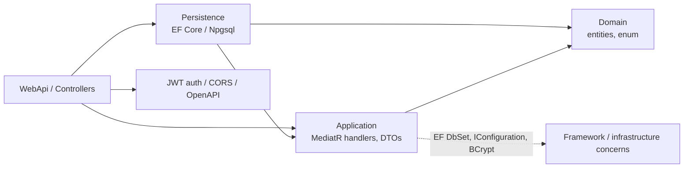

# Báo cáo audit backend ComicWeb

**Phạm vi.** Static-code audit toàn bộ mã nguồn có trong `D:\Hai\ComicWebBackend` ngày 20-07-2026. Các kết luận “Không tìm thấy” nghĩa là không có implementation, migration, endpoint hoặc test tương ứng trong repository tại thời điểm audit; không phải suy đoán về hệ thống ngoài repo. Build không chạy được trên máy audit vì thiếu targeting pack `Microsoft.NETCore.App` cho `net9.0` và các package restore bị thiếu (`NETSDK1127`, `NETSDK1064`).

## A. Executive summary

Điểm sẵn sàng cho Next.js: **28/100 – chưa sẵn sàng cho frontend MVP đã mô tả**. Đây là một skeleton tốt cho CRUD nội bộ tối thiểu, không phải backend complete cho web đọc truyện. Có JWT validation, CORS origin allow-list, EF Core migration và tách project Domain/Application/Persistence/WebApi. Tuy nhiên chỉ có 10 endpoint, trong khi phần lớn các nghiệp vụ yêu cầu chưa tồn tại; không có user journey, campaign, media, category/tag, publish workflow, tracking, refresh/revoke token hay test.

Rủi ro P0 lớn nhất là thông tin bí mật và default admin đã commit: connection password, JWT signing key và mật khẩu admin xuất hiện trong `src/3.Presentation/ComicWeb.WebApi/appsettings.json:8-20`; user seed có password mặc định trong `UserConfiguration.Configure:22-32`. JWT claim role bị hard-code là `Admin` thay vì lấy `user.Role` trong `LoginCommandHandler.Handle:50-55`. Mọi bearer token hợp lệ của bất kỳ user record nào cũng trở thành admin.

## B. Kiến trúc hiện tại và dependency direction



| Layer/module | Evidence | Dependency | Assessment |
|---|---|---|---|
| Domain | `Entities/*.cs`, `StoryStatus.cs` | none | Entities exist, but all business state is public/settable and has no behavior/invariants. |
| Application | handlers under `Features`, DTOs, `IApplicationDbContext` | Domain, EF Core, IConfiguration, BCrypt | Direction is partly inward, but `IApplicationDbContext` exposes `DbSet` (`IApplicationDbContext.cs:11-20`), so EF leaks into use cases. Login creates JWT and checks BCrypt (`LoginCommandHandler.cs:31-62`), both infrastructure/security adapters. |
| Persistence | `ApplicationDbContext`, configurations, migrations | Application + Domain + EF/Npgsql | Correctly implements Application interface (`ApplicationDbContext.cs:12` and DI `DependencyInjection.cs:17`); direct Domain reference is expected. |
| Presentation | Program, controllers, middleware | Application + Persistence | Composition root is appropriate (`Program.cs:49-53`), controllers use MediatR. |

**Verdict Clean Architecture:** folder/project layout and dependency inversion are present, but this is **not yet Clean Architecture in practice**. Domain is anemic (`Story.cs:11-20`, `Chapter.cs:10-23`, `User.cs:9-17`); handlers directly mutate entities and call EF; security infrastructure resides in Application. Move password verification/token generation behind `IPasswordHasher`/`ITokenService`; replace `DbSet` interface with repositories or query/write ports; move publish/order/link validation into aggregate methods and domain/application policies.

## C. Điểm tốt

- Controller write routes have an Admin policy: Story `StoriesController.cs:31-60`, Chapter `ChaptersController.cs:25-56`, dashboard `AdminController.cs:7-18`.
- JWT validation validates issuer, audience, signature and lifetime with zero clock skew (`Program.cs:36-46`); timestamps are generally UTC (`BaseEntity.cs:12-13`, command handlers).
- CORS has explicit allowed origins instead of wildcard while credentials are allowed (`Program.cs:12-22`).
- Reads generally use `AsNoTracking`; story detail eager-loads chapters, avoiding that particular N+1 (`GetStoryByIdQuery.Handle:28-37`).
- FK Story→Chapter and cascade delete, username unique index, Story title index and Chapter StoryId index exist (`ChapterConfiguration.cs:27-31`, `UserConfiguration.cs:16-18`, `StoryConfiguration.cs:31`; snapshot `ApplicationDbContextModelSnapshot.cs:63-68`).
- DTOs prevent returning `User.PasswordHash`; OpenAPI is registered in Development (`Program.cs:69-81`).

## D. Implemented use cases

`Tx` means one implicit `SaveChanges` transaction where shown. “Validation” is implementation actually present, not intended validation.

| Area/use case | Input → output | Actor/permission | Tx/validation/errors | Test |
|---|---|---|---|---|
| Login | `LoginCommand(username,password)` → token, username, expiration | anonymous; endpoint is `POST /api/auth/login` | read only; username lookup + BCrypt; invalid user/password → 401 at controller | Không tìm thấy |
| List stories | none → `List<StoryDto>` | anonymous | read only; no filter/sort/page; no errors handled | Không tìm thấy |
| Story detail | story id → `StoryDetailDto` with chapter list | anonymous | read only; 404 if missing; includes every chapter | Không tìm thấy |
| Story chapters | story id → `List<ChapterListDto>` | anonymous | read only; ordered by number; returns empty even for a non-existent story | Không tìm thấy |
| Chapter read | chapter id → content/link/locked DTO | anonymous | read only; 404 if missing; lock hides content but link is exposed | Không tìm thấy |
| Create story | title, description, cover URL → id | Admin at controller | one `SaveChanges`; no required/length/URL/unique validation | Không tìm thấy |
| Update/delete story | full fields/id → bool | Admin at controller only | one `SaveChanges`; 404 mapped; delete is hard delete and cascades chapters | Không tìm thấy |
| Create/update/delete chapter | storyId, number, title, content, link, locked → id/bool | Admin at controller only | one `SaveChanges`; no story existence, duplicate order, content/link validation | Không tìm thấy |
| Dashboard stats | none → six counts | Admin at controller | read only; six sequential count queries | Không tìm thấy |
| System-log list | page/pageSize → `List<SystemLogDto>` | Admin at controller | read only; no bound/total/search; negative values can reach `Skip/Take` | Không tìm thấy |

**Không tìm thấy:** registration, `/auth/me`, refresh, logout/revoke; user profile/history/follow; category/tag; campaign and targets/impression/click; feedback; user notification delivery/read; audit-log writer; analytics; upload/media; draft/publish/unpublish/scheduling; fanpage API. `UserNotification` and `SystemLog` are only modelled/read (`ApplicationDbContext.cs:20-22`, `GetSystemLogsQuery.cs:19-27`), not written or exposed as notifications.

## E. API inventory

Base path derives from `BaseApiController.cs:6-8`. Response/error format is inconsistent: successful DTO/raw anonymous object, controller `{message}`, and middleware `{statusCode,message,detailed}` (`ExceptionHandlingMiddleware.cs:38-46`). No requestId.

| Method/path | Auth / role | Request → response | Paging/filter/sort | Status |
|---|---|---|---|---|
| POST `/api/auth/login` | public | `LoginCommand` → `AuthResultDto`; 401 | none | Partial: only login, raw access token response |
| GET `/api/stories` | public | none → `List<StoryDto>` | none | Incomplete |
| GET `/api/stories/{id}` | public | id → `StoryDetailDto`; 404 | none | Partial: no slug/count/latest chapter |
| GET `/api/stories/{id}/chapters` | public | id → list; never verifies story | orders chapter number | Partial |
| POST `/api/stories` | Admin | command → `{id,message}` | n/a | Incomplete validation/201/location |
| PUT `/api/stories/{id}` | Admin | full command → `{message}`; 400/404 | n/a | Incomplete concurrency/publish workflow |
| DELETE `/api/stories/{id}` | Admin | id → `{message}`; 404 | n/a | Incorrect for expected soft delete |
| GET `/api/chapters/{id}` | public | id → `ChapterDetailResultDto`; 404 | none | Partial: no prev/next, no content policy/sanitization |
| POST/PUT/DELETE `/api/chapters[/{id}]` | Admin | corresponding commands → anonymous response; 400/404 on PUT | n/a | Incomplete validation/order/concurrency |
| GET `/api/admin/stats` | Admin | none → `AdminStatsDto` | none | Partial dashboard |
| GET `/api/admin/logs?page&pageSize` | Admin | query → `List<SystemLogDto>` | offset only, no total/bounds/search | Partial |

**Missing frontend API:** `/auth/me`, refresh/logout; users; categories/tags; search/filter/sort/paged stories; story-by-slug; read-history/follow; feedback; notification list/read; all campaign admin/public/tracking/redirect APIs; media upload; publish/unpublish/schedule; dashboard time series; audit search; latest/hot/home feeds; fanpage config. No OpenAPI UI is configured; raw OpenAPI is mapped only under Development (`Program.cs:75-81`).

## F. Security and authorization

| Control | Finding/evidence | Severity |
|---|---|---|
| Access token | Bearer JWT is returned in JSON and lasts 1,440 minutes (`appsettings.json:15-20`, `AuthResultDto.cs:9`). Signing/validation are configured. | High |
| Role escalation | Login constructs `ClaimTypes.Role` as literal `Admin`, ignoring `user.Role` (`LoginCommandHandler.cs:50-55`). Any valid credential becomes admin. | Critical |
| Secrets/default admin | JWT secret, database password and default admin password committed (`appsettings.json:8-25`); seed uses known password (`UserConfiguration.cs:22-32`). Rotate/remove immediately. | Critical |
| Refresh rotation/revoke/logout | Không tìm thấy refresh-token model, endpoint, cookie, blacklist/revocation or logout. | High |
| Cookie/CSRF | No auth cookie is set, so cookie flags/CSRF protection are not applicable to current bearer design. If Next.js later uses HttpOnly cookies, implement `Secure`, `HttpOnly`, `SameSite`, CSRF token/origin protection. | High (future) |
| Brute force/rate limit | Không tìm thấy `AddRateLimiter`, lockout, IP/account throttle or CAPTCHA. Login is online-password-guessable. | High |
| RBAC / defense in depth | A single controller policy checks `Admin` (`Program.cs:64-67`); use cases receive no actor and independently have no authorization. Reusing a command outside controller bypasses authorization. | High |
| IDOR | Current admin writes select by supplied entity id and only role-gate; no owner-scoped resources exist. No proven cross-user IDOR today, but its pattern will create one when histories/feedback are added. | Medium |
| Unsafe affiliate redirect | `AffiliateLink` is admin-writable and served to public without URI scheme/host validation (`CreateChapterCommandHandler.cs:32-40`, `GetChapterDetailQuery.cs:32-42`). | High |
| Error disclosure | 500 responses reveal exception message in every environment (`ExceptionHandlingMiddleware.cs:38-46`). | Medium |

Content security: EF LINQ calls are parameterized, so **no direct SQL injection implementation found**. But `Chapter.Content` is returned unsanitized (`GetChapterDetailQuery.cs:46-53`): if frontend renders HTML, stored XSS is possible. No upload endpoints/storage, MIME/size/image decode/malware scanning/path traversal or SSRF implementation found. Commands bind directly to public records, so currently only explicitly declared fields are mass-assignable; retain dedicated request DTOs as the model expands. No unsafe server redirect is found, but unsafe client navigation is enabled by affiliate link.

## G. Domain/database assessment

Only these persisted domain entities exist: `User`, `Story`, `Chapter`, `SystemLog`, `UserNotification` (`ApplicationDbContext.cs:18-22`). **Không tìm thấy** Role entity/permission, Category, Tag, StoryCategory, Campaign, CampaignTarget/Impression/Click, Feedback, AuditLog (separate from SystemLog), ReadingHistory, FollowedStory, Media.

| Model / rule | Audit result |
|---|---|
| Aggregates/value objects/invariants | No aggregate methods or value objects. Public setters permit invalid values (`Chapter.cs:12-22`, `Story.cs:13-20`). Make Story aggregate root and restrict chapter mutation to validated methods. |
| User/role | Role is arbitrary nullable-by-schema string defaulting to `Admin` (`User.cs:12-16`); email has no unique index; no normal USER seed/role behaviour/permission model. |
| Story state | `StoryStatus` is only Ongoing/Completed/Paused (`StoryStatus.cs:9-14`), not draft/published/unpublished/scheduled. No `PublishedAt`, schedule or soft-delete. |
| Slug | Không tìm thấy slug property or unique slug index. |
| Chapter ordering | Query sorts by number (`GetChaptersByStoryQuery.cs:21-26`), but no `UNIQUE(StoryId, ChapterNumber)`, no positive validation, and writes do not verify StoryId (`CreateChapterCommandHandler.cs:30-44`). Duplicate/reordered chapters can occur. |
| Concurrency | Không tìm thấy row version/ETag/concurrency token. Full writes can lose updates. |
| Deletion | Story and chapter use `Remove` (`DeleteStoryCommandHandler.cs:25`, `DeleteChapterCommandHandler.cs:25`) and Story cascade physically deletes chapters (`ChapterConfiguration.cs:27-31`). |
| Dates | Most writes use `DateTime.UtcNow`; PostgreSQL columns are `timestamp with time zone` in snapshot. Chapter inherits `CreateAt` and separately owns `CreatedAt`, producing duplicate/ambiguous timestamps (`BaseEntity.cs:11-14`, `Chapter.cs:21-22`). |

Schema/migration: migrations do exist, including initial and follow-up files, and EF configuration is applied from assembly (`ApplicationDbContext.cs:24-30`). No automated migration invocation, backup policy, restore drill, or deployment migration strategy is found. The only indexes are `Users.Username UNIQUE`, `Stories.Title`, `Chapters.StoryId` (snapshot lines 63-68, 103-105, 166-170). No foreign key is configured for `UserNotification.StoryId/ChapterId` even though fields exist (`UserNotification.cs:12-15`).

Performance: no cache/CDN/compression/cache invalidation/view counting/background queue is found. `GetStoriesQuery` loads every row with no order/paging (`GetStoriesQuery.cs:27-35`). `GetAdminStatsQuery` executes six database round trips sequentially (`GetAdminStatsQuery.cs:21-27`). Detail uses one eager-loaded query, so no N+1 there. There is no implementation for home/new/hot/latest queries, thus no query plan to assess.

## H. Risk matrix

| ID | Severity | Probability | Impact | Evidence | Recommendation |
|---|---|---|---|---|---|
| R1 | Critical | High | Full admin takeover/DB compromise | `appsettings.json:8-25` | Revoke/rotate secret and DB credential, purge Git history where applicable, use secret manager/vault/env config, bootstrap admin securely. |
| R2 | Critical | High | Any user can access admin APIs | literal Admin role in `LoginCommandHandler.cs:50-55` | Emit validated `user.Role`; implement role/permission enum and test user/admin tokens. |
| R3 | High | High | Account takeover via guessing; no session termination | no rate/refresh/logout code | Add rate limiter+lockout, hashed rotating refresh sessions, reuse detection, revoke/logout. |
| R4 | High | High | Frontend required features unavailable | only 10 endpoints and five entities | Implement MVP vertical slices listed below before integration. |
| R5 | High | Medium | XSS/phishing/affiliate abuse | `GetChapterDetailQuery.cs:46-53`; link fields | Sanitize/canonicalize content, validate URL scheme and Shopee allow-list, redirect by campaign id. |
| R6 | High | Medium | Data integrity/lost update | public setters, no uniqueness/concurrency | DB constraints + row version/ETag + aggregate methods/transactions. |
| R7 | Medium | High | Information leak/inconsistent client handling | middleware `detailed` at lines 38-46 | RFC 7807 problem-details, stable code, requestId; log exception server-side only. |
| R8 | Medium | Medium | Data loss/no compliance trace | hard delete/cascade, no audit writer | Soft-delete content, immutable audit event/outbox and retention policy. |

## I. Breaking changes required

1. Replace raw `AuthResultDto.Token` with a short-lived access-token contract plus HttpOnly refresh-cookie/session flow; clients must stop persisting the long-lived raw token.
2. Change Story API from numeric ID/public unbounded list to paged envelopes and `slug`; add `status`, `publishedAt`, `chapterCount`, `latestChapter`.
3. Remove `AffiliateLink` from Chapter create/read DTO. Use campaign IDs and a validated tracking redirect.
4. Change all endpoints to `{ data, meta, requestId }` and RFC 7807 errors; return 201/204 where appropriate.
5. Make delete soft delete and require `If-Match`/row version for write routes.

## J. Roadmap and Jira-ready tasks

### P0 – block release

- **SEC-001 Rotate committed credentials and eliminate seed admin secret.** Use environment/secret vault; force reset admin and invalidate all JWTs.
- **SEC-002 Fix role escalation.** Claim `user.Role`, reject unsupported role, write authorization tests for User vs Admin.
- **AUTH-001 Implement refresh-session rotation, logout/revoke, `/auth/me`, login rate limiting/lockout.** Store only hashed refresh token, device/IP metadata, expiry and reuse-revocation.
- **API-001 Standardize response/error and request correlation.** ProblemDetails with code/requestId; disable `exception.Message` response in production.
- **CONTENT-001 Sanitize chapter content and validate affiliate URI.** Allow-list scheme/host; never expose arbitrary redirect target.

### P1 – frontend MVP vertical slices

- **DOM-001 Add Story publishing aggregate.** Draft/publish/unpublish/schedule states, `PublishedAt`, slug, soft delete and optimistic concurrency.
- **DOM-002 Enforce chapter integrity.** FK existence, `UNIQUE(story_id, chapter_number)`, transactional reorder, previous/next result.
- **USER-001 Implement registration/profile/history/follow/feedback/notifications** with actor ownership checks.
- **CAT-001 Implement Category/Tag/StoryCategory** plus admin CRUD and public filters.
- **API-002 Implement paged search/home/new/hot/latest and story detail projection.**
- **MEDIA-001 Add media upload pipeline.** Object storage, image MIME/signature/size/dimension validation, random key, AV scan/quarantine, CDN URLs.

### P2 – campaign, observability, resilience

- **CMP-001 Add Campaign, targets, frequency caps, start/end, disclosure and active-context endpoint.**
- **CMP-002 Add idempotent impression/click tracking and server-side allow-listed redirect.**
- **OBS-001 Separate structured app logs from immutable audit logs.** Actor/action/entity/before-after/IP/UA/requestId; paged searchable admin view and retention.
- **PERF-001 Add response cache/Redis, publish invalidation, compression and async analytics aggregation.**
- **DB-001 Define backup/restore, migration CI/CD and UTC policy.**

### P3 – hardening/operations

- **TEST-001 Create test pyramid and contract tests from OpenAPI.**
- **OPS-001 Add health checks, metrics/tracing, alerts, security headers and dependency scanning.**

## K. Definition of Done for backend MVP

- No plaintext/committed credential or hard-coded privilege; secrets rotated and CI secret scan passes.
- User/Admin authentication, refresh rotation/revoke, `/auth/me`, throttling and owner/role tests pass.
- Public story listing/search/filter/paging, story detail (chapterCount/latest), chapter read (prev/next), history/follow/feedback and notification flows are integrated.
- Admin Story/Chapter/Category/Tag/Media and publish/schedule workflows validate input, authorize in application layer, audit changes, enforce soft delete/concurrency/order uniqueness.
- Campaign is allow-listed, time/target/frequency-aware, disclosure-aware and has idempotent tracking.
- All API errors/responses documented in OpenAPI, versioned, contract-tested and include requestId.
- Migrations, indexes, backup/restore, retention, structured logs, health metrics and cache invalidation are deployed and tested.

## L. Proposed contracts and indexes

Example envelope:

```json
// GET /api/v1/stories?query=one-piece&status=published&page=1&pageSize=20&sort=-publishedAt
{
  "data": [{ "id": "uuid", "slug": "one-piece", "title": "...", "chapterCount": 1100,
    "latestChapter": { "id": "uuid", "number": 1100, "publishedAt": "2026-07-20T00:00:00Z" } }],
  "meta": { "page": 1, "pageSize": 20, "total": 84 }, "requestId": "..."
}
```

```json
// GET /api/v1/chapters/{chapterId}
{ "data": { "id":"uuid", "story":{"slug":"..."}, "number":12, "content":"sanitized HTML",
  "previousChapter":{"id":"...","number":11}, "nextChapter":{"id":"...","number":13} }, "requestId":"..." }
```

Suggested PostgreSQL indexes/constraints: `users(lower(email)) UNIQUE`; `stories(slug) UNIQUE WHERE deleted_at IS NULL`; `stories(status, published_at DESC) WHERE deleted_at IS NULL`; trigram/GiN search for title/author; `chapters(story_id, chapter_number) UNIQUE`; `chapters(story_id, published_at DESC)`; `reading_histories(user_id, story_id) UNIQUE`; `followed_stories(user_id, story_id) UNIQUE`; `campaigns(status,start_at,end_at)`; target indexes by `(story_id,chapter_id,device)`; impressions/clicks `(campaign_id, visitor_hash, occurred_at)` and idempotency key unique; audit `(entity_type,entity_id,occurred_at DESC)` and `(actor_id,occurred_at DESC)`.

## M. Test plan

**Không tìm thấy test project or test source.** Add unit tests for Story transitions, invalid schedule, slug/order uniqueness and link policy; handler tests for not found/validation; integration tests against PostgreSQL for constraints/migrations/query projections; authorization matrix for every endpoint and ownership/IDOR; security tests for login throttle, role claim, refresh reuse/revoke, XSS sanitizer, bad MIME/oversize/path traversal/SSRF/redirect; contract tests generated from OpenAPI; E2E tests for publish/unpublish/schedule, chapter reorder/concurrent ETag conflict, history/follow/feedback, campaign frequency/idempotency, cache invalidation and backup restore.

## N. Final readiness score

| Dimension | Score / 20 | Reason |
|---|---:|---|
| Core functional coverage | 5 | Story/Chapter basics only; most requested modules absent. |
| API/frontend contract | 5 | Controllers/DTOs exist, but no pagination/search/consistent envelope/required endpoints. |
| Security | 2 | JWT validation exists, but critical role and secret issues; no session lifecycle/rate limit. |
| Data/domain integrity | 7 | EF migration/FK/basic indexes/UTC exist; missing critical constraints/workflow/concurrency. |
| Quality/operations | 9 | Project separation, middleware and OpenAPI exist; no tests, cache, audit writer, backup/metrics. |
| **Total** | **28/100** | **Do not start broad frontend integration until P0 and P1 are addressed.** |
