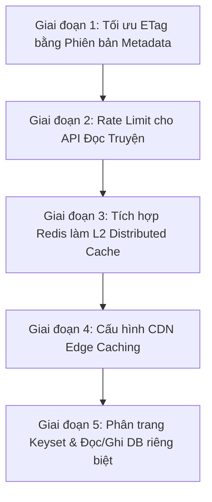

# Báo Cáo Rà Soát Backend & Kế Hoạch Tối Ưu Hóa Đọc Truyện Lưu Lượng Lớn (High-Traffic)

Tài liệu này được lập ra nhằm rà soát toàn bộ kiến trúc hiện tại của Backend (`ComicWebBackend`), đánh giá mức độ sẵn sàng và đưa ra kế hoạch tối ưu hóa cụ thể khi hệ thống gặp lượng truy cập đọc truyện cực lớn (High-Traffic Reading).

---

## 1. Rà Soát Toàn Bộ Kiến Trúc Backend Hiện Tại (Cập nhật: 05-08-2026)

Hệ thống đã có nhiều cải tiến lớn và giải quyết hầu hết các điểm yếu nghiêm trọng (P0/P1) từ báo cáo audit trước đó (20-07-2026). Dưới đây là phân tích chi tiết:

### A. Cấu trúc dự án và thiết kế Clean Architecture
- **1.Core (`ComicWeb.Domain` & `ComicWeb.Application`):** 
  - Đã đóng gói các thực thể nghiệp vụ tốt hơn. Các thực thể chính như [Story.cs](file:///d:/Hai/ComicWebBackend/src/1.Core/ComicWeb.Domain/Entities/Story.cs) và [Chapter.cs](file:///d:/Hai/ComicWebBackend/src/1.Core/ComicWeb.Domain/Entities/Chapter.cs) đã sử dụng encapsulation (các method thay đổi trạng thái như `Publish`, `Schedule`, `SoftDelete` đi kèm logic xác thực nghiệp vụ và tự động tăng `Version`).
  - Phân tách rõ ràng giữa Admin Use Cases ([AdminContent.cs](file:///d:/Hai/ComicWebBackend/src/1.Core/ComicWeb.Application/Features/Stories/AdminContent.cs)) và Public Use Cases ([PublicReading.cs](file:///d:/Hai/ComicWebBackend/src/1.Core/ComicWeb.Application/Features/Stories/PublicReading.cs)).
- **2.Infrastructure (`ComicWeb.Persistence`):**
  - Quản lý truy xuất cơ sở dữ liệu qua EF Core.
  - Tích hợp hệ thống ghi nhật ký kiểm toán ([AuditLog](file:///d:/Hai/ComicWebBackend/src/1.Core/ComicWeb.Domain/Entities/AuditLog.cs)), phiên làm việc làm mới ([RefreshSession](file:///d:/Hai/ComicWebBackend/src/1.Core/ComicWeb.Domain/Entities/RefreshSession.cs)) và thể loại ([Genre](file:///d:/Hai/ComicWebBackend/src/1.Core/ComicWeb.Domain/Entities/Genre.cs)).
- **3.Presentation (`ComicWeb.WebApi`):**
  - Triển khai xác thực JWT an toàn, quản lý phân quyền chặt chẽ (`AdminOnly` policy yêu cầu claim `password_changed == True` và kiểm tra tài khoản active).
  - Có cơ chế xử lý lỗi tập trung qua [ExceptionHandlingMiddleware](file:///d:/Hai/ComicWebBackend/src/3.Presentation/ComicWeb.WebApi/Middlewares/ExceptionHandlingMiddleware.cs) trả về ProblemDetails tiêu chuẩn.

### B. Cơ chế Caching hiện tại (Điểm mấu chốt cho đọc truyện)
- **Local Memory Cache (`IMemoryCache`):** 
  - Triển khai lớp [PublicContentCache](file:///d:/Hai/ComicWebBackend/src/2.Infrastructure/ComicWeb.Persistence/Caching/PublicContentCache.cs) để lưu trữ danh sách truyện, chi tiết truyện, danh sách chương và chi tiết chương.
  - Các TTL (Time To Live) cấu hình động trong `appsettings.json`: Danh sách truyện (30s), Chi tiết truyện (120s), Danh sách chương (120s), Chi tiết chương (600s).
- **Chống Cache Stampede (Thảm họa sập cache):**
  - Sử dụng [KeyedLockManager](file:///d:/Hai/ComicWebBackend/src/1.Core/ComicWeb.Application/Common/Caching/KeyedLockManager.cs) để thực hiện cơ chế khóa theo khóa (Single Flight / Coalescing). Khi cache bị lạnh (cold cache) và có hàng ngàn request đồng thời vào cùng một chương truyện, chỉ có **1 request duy nhất** được phép truy vấn xuống Database để nạp lại cache, các request còn lại sẽ đợi và lấy kết quả từ cache sau khi nạp xong. Điều này bảo vệ database tối đa.
- **Tự động Invalidate Cache:**
  - Lớp [PublicContentCacheInvalidator](file:///d:/Hai/ComicWebBackend/src/2.Infrastructure/ComicWeb.Persistence/Caching/PublicContentCacheInvalidator.cs) tự động xóa cache tương ứng (bằng key hoặc prefix) khi Admin cập nhật truyện, thêm chương mới hoặc thay đổi trạng thái xuất bản.
- **Nén phản hồi (Response Compression):**
  - Đã cấu hình Brotli và Gzip trong [Program.cs](file:///d:/Hai/ComicWebBackend/src/3.Presentation/ComicWeb.WebApi/Program.cs#L256-L266) giúp tiết kiệm băng thông khi truyền tải nội dung chương truyện lớn.

### C. Cơ chế HTTP Conditional GET (ETag & 304 Not Modified)
- Đang sử dụng phương thức `HandleConditionalGet` tại [PublicStoriesController.cs](file:///d:/Hai/ComicWebBackend/src/3.Presentation/ComicWeb.WebApi/Controllers/PublicStoriesController.cs#L59-L78).
- ETag được tạo bằng cách **serialize toàn bộ DTO kết quả sang JSON rồi băm SHA256**.
- Giúp trình duyệt hoặc CDN trả về trạng thái `304 Not Modified` nhanh chóng mà không cần tải lại toàn bộ nội dung.

---

## 2. Các Nút Thắt Hiệu Năng (Bottlenecks) Khi Gặp Lượng Truy Cập Đọc Truyện Cực Lớn

Mặc dù kiến trúc hiện tại đã rất tốt và có cache bảo vệ DB, nhưng dưới tải trọng rất lớn (ví dụ: hàng trăm ngàn lượt đọc cùng lúc khi có chương mới), hệ thống sẽ gặp các vấn đề sau:

### Nút thắt 1: Giới hạn của Memory Cache cục bộ (Local Caching) khi Scale ngang
- `IMemoryCache` lưu trực tiếp trên RAM của ứng dụng. Khi chạy thực tế trên môi trường Kubernetes hoặc nhiều Docker Containers sau một bộ Load Balancer:
  - **Dữ liệu không đồng bộ:** Container A xóa cache vì Admin sửa truyện, nhưng Container B và C vẫn giữ cache cũ cho đến khi hết TTL.
  - **Tải DB nhân lên:** Mỗi container phải tự truy vấn DB ít nhất 1 lần để lấp đầy cache nội bộ của nó.
  - **Không có Distributed Lock:** `KeyedLockManager` sử dụng `SemaphoreSlim` chỉ hoạt động trong phạm vi bộ nhớ của **một container**. Các container khác nhau vẫn sẽ đồng thời chọc xuống DB khi cache bị lạnh.

### Nút thắt 2: CPU/Memory Quá Tải tại Web API do Tính Toán ETag Thủ Công
- Hiện tại, để tạo ETag, Web API phải:
  1. Lấy dữ liệu DTO từ cache (hoặc DB).
  2. Thực hiện tuần tự hóa (Serialize) toàn bộ DTO thành chuỗi JSON.
  3. Băm SHA256 chuỗi JSON đó để tạo chuỗi ETag.
- Với nội dung chương truyện (Chapter Content) rất dài (chứa hàng ngàn từ HTML), việc **Serialize + Hash liên tục cho mỗi request** sẽ ngốn lượng lớn tài nguyên CPU và RAM của máy chủ Web API, dẫn đến nghẽn cổ chai ngay tại Web API chứ chưa nói đến Database.

### Nút thắt 3: Thuật toán Phân trang Offset (Skip/Take) chậm dần theo thời gian
- API danh sách truyện và danh sách chương đang sử dụng `Skip((page - 1) * pageSize).Take(pageSize)`.
- Khi số lượng truyện hoặc chương tăng lên đến hàng chục ngàn và người dùng click vào các trang sâu (hoặc bot cào dữ liệu), PostgreSQL phải quét qua toàn bộ dữ liệu trước đó rồi mới lấy ra trang tiếp theo. Điều này gây tốn I/O đĩa và RAM của cơ sở dữ liệu.

### Nút thắt 4: Nguy cơ cào dữ liệu (Crawler/Scraper Bot) làm sập hệ thống
- Hiện tại, cơ chế giới hạn tần suất (Rate Limiting) chỉ được áp dụng cho API `login` và `refresh` trong [Program.cs](file:///d:/Hai/ComicWebBackend/src/3.Presentation/ComicWeb.WebApi/Program.cs#L165-L212).
- Các API đọc truyện công khai như `/api/v1/stories/{slug}/chapters/{chapterSlug}` hoàn toàn không có rate limit. Một bot cào truyện có thể gửi hàng ngàn request mỗi giây để tải nội dung chương, làm cạn kiệt băng thông và tài nguyên hệ thống.

---

## 3. Kế Hoạch Tối Ưu Hóa Chi Tiết & Từng Bước Triển Khai (Tránh Phá Vỡ Hệ Thống)

Để tối ưu hóa phần đọc truyện mà không làm ảnh hưởng đến cấu trúc Clean Architecture và các API admin hiện tại, chúng ta sẽ triển khai theo các giai đoạn sau:



---

### Giai đoạn 1: Tối ưu hóa việc tạo ETag bằng Phiên bản Thực thể (Version-based ETag)
**Mục tiêu:** Tránh việc Serialize và Hash SHA256 nội dung chương truyện trên CPU của Web API.

#### Giải pháp chi tiết:
- Thay vì băm toàn bộ DTO, ta sẽ tận dụng trường thuộc tính `Version` và `UpdateAt` của thực thể `Story` và `Chapter` để tạo ETag siêu nhẹ dạng:
  `ETag = "{Entity_Version}_{Entity_UpdateAt_Ticks}"`
- **Ví dụ với Chapter Detail:**
  - DTO `PublicChapterDetailDto` hiện tại đã có `PublishedAt` hoặc ta có thể bổ sung trường `Version` và `UpdatedAt` (hoặc tính toán trực tiếp từ database).
  - Khi client gửi request kèm header `If-None-Match`, chúng ta chỉ cần so sánh chuỗi ETag metadata gọn nhẹ này. Nếu khớp, trả ngay `304 Not Modified` mà không cần serialize hay chạy logic nặng nề.

#### Cách triển khai an toàn:
1. Sửa method `HandleConditionalGet` trong `PublicStoriesController.cs` để nhận vào thông tin phiên bản (ví dụ: `int version` và `DateTime? updatedAt`) thay vì nhận vào nguyên object DTO.
2. Sửa đổi nhỏ các query handler để trả về thông tin version/updateAt của Story/Chapter nếu chưa có.

---

### Giai đoạn 2: Áp dụng Rate Limiting cho các API công khai (Public Reading APIs)
**Mục tiêu:** Ngăn chặn các cuộc tấn công DDoS và bot cào dữ liệu làm nghẽn hệ thống.

#### Giải pháp chi tiết:
- Thêm cấu hình Rate Limit chính sách `public-reading` trong [Program.cs](file:///d:/Hai/ComicWebBackend/src/3.Presentation/ComicWeb.WebApi/Program.cs#L165-L212):
  - Áp dụng giới hạn dựa trên IP của người dùng (Remote IP Address).
  - Ví dụ: Tối đa 60 request/phút cho các API đọc truyện. Nếu vượt quá, trả về mã lỗi `429 Too Many Requests`.
- Đính kèm attribute `[EnableRateLimiting("public-reading")]` vào `PublicStoriesController.cs`.

---

### Giai đoạn 3: Nâng cấp lên Hybrid Caching (L1 Local Memory + L2 Redis Distributed Cache)
**Mục tiêu:** Chia sẻ dữ liệu cache giữa nhiều server instance và đồng bộ hóa việc xóa cache.

#### Giải pháp chi tiết:
- Giữ nguyên interface `IPublicContentCache`. Điều này giúp đảm bảo mã nguồn trong lớp `Application` không bị thay đổi (không phá vỡ Clean Architecture).
- Triển khai một class mới kế thừa `IPublicContentCache` sử dụng **Redis**:
  - **L1 Cache (RAM cục bộ):** Giữ lại `IMemoryCache` cho các truy xuất siêu nhanh (dưới 1ms), TTL rất ngắn (ví dụ: 10s).
  - **L2 Cache (Redis):** Nếu L1 không có, truy vấn Redis. Redis giữ dữ liệu với TTL lâu hơn (ví dụ: 10 phút).
  - **Đồng bộ hóa (Pub/Sub):** Khi Admin cập nhật dữ liệu và gọi `Invalidate`, hệ thống sẽ gửi một message qua Redis Pub/Sub để tất cả các server instances tự động xóa L1 Cache của mình.
- Sử dụng **Redis Distributed Lock** (như thư viện `RedLock.net`) để thay thế cho `KeyedLockManager` cục bộ, đảm bảo chỉ có 1 request trên toàn bộ hệ thống truy vấn DB khi cold cache.

---

### Giai đoạn 4: Cấu hình CDN Edge Caching (Cloudflare / Vercel)
**Mục tiêu:** Chuyển phần lớn lưu lượng đọc truyện tĩnh ra ngoài máy chủ Backend, giúp giảm tải đến 90% cho BE.

#### Giải pháp chi tiết:
- Khi phục vụ chi tiết chương truyện (vốn là dữ liệu rất ít khi thay đổi sau khi xuất bản), API Backend sẽ trả về header:
  `Cache-Control: public, max-age=60, s-maxage=3600, stale-while-revalidate=120`
  - `max-age=60`: Trình duyệt cá nhân của người đọc cache lại trong 1 phút.
  - `s-maxage=3600`: Các máy chủ CDN (Cloudflare) sẽ cache chương truyện này trong 1 giờ.
  - `stale-while-revalidate=120`: Cho phép CDN trả về dữ liệu cũ (stale) trong vòng 2 phút trong khi chạy ngầm một request xuống BE để cập nhật cache mới.
- **Cơ chế Purge CDN khi sửa truyện:**
  - Trong `PublicContentCacheInvalidator`, bổ sung lệnh gọi API của Cloudflare để xóa cache (Purge Cache) theo URL hoặc Cache Tag khi Admin thực hiện cập nhật hoặc ẩn chương truyện.

---

### Giai đoạn 5: Tối ưu hóa phân trang sâu và Tách biệt kết nối Đọc/Ghi (CQRS Database)
**Mục tiêu:** Giảm tải I/O trên cơ sở dữ liệu PostgreSQL.

#### Giải pháp chi tiết:
- **Phân trang Keyset (Cursor-based Pagination):**
  - Chuyển đổi API danh sách chương từ offset (`page` & `pageSize`) sang cursor (`lastChapterNumber`).
  - Truy vấn sẽ có dạng: `WHERE StoryId = @StoryId AND ChapterNumber > @LastChapterNumber ORDER BY ChapterNumber LIMIT @PageSize`.
  - Truy vấn này tận dụng triệt để index có sẵn `(StoryId, ChapterNumber)` và có thời gian phản hồi cực nhanh (O(log N)) bất kể trang sâu đến đâu.
- **Tách kết nối Đọc/Ghi database (Read/Write Splitting):**
  - Định nghĩa thêm một chuỗi kết nối phụ `ConnectionStrings:ReadOnlyConnection` trỏ đến một Database Read Replica của PostgreSQL.
  - Cấu hình Dependency Injection để các Query Handler công khai sử dụng DbContext cấu hình read-only này, giảm tải hoàn toàn cho Master Database (vốn chỉ dành cho Admin ghi dữ liệu và xử lý thanh toán/user session).

---

## 4. Hướng Dẫn Thực Hiện Tránh Phá Vỡ Hệ Thống (Safe Implementation Guidelines)

Để đảm bảo việc tối ưu hóa diễn ra suôn sẻ, không phát sinh lỗi nghiệp vụ và duy trì tính ổn định:

1. **Không thay đổi Interface cốt lõi trong Application:**
   - Các interface như `IPublicContentCache`, `IApplicationDbContext` không nên bị xóa bỏ hay thay đổi cấu trúc lớn. Hãy triển khai các adapter mới ở lớp `Persistence` và thay thế đăng ký DI trong [DependencyInjection.cs](file:///d:/Hai/ComicWebBackend/src/2.Infrastructure/ComicWeb.Persistence/DependencyInjection.cs).
2. **Tận dụng bộ Integration Tests hiện có:**
   - Dự án đã có sẵn file test hiệu năng cache tích hợp rất tốt: [PublicCachePerformanceTests.cs](file:///d:/Hai/ComicWebBackend/tests/ComicWeb.WebApi.IntegrationTests/PublicCachePerformanceTests.cs).
   - Mỗi lần tinh chỉnh cơ chế ETag hay Caching, hãy chạy lệnh dotnet test:
     ```powershell
     dotnet test tests/ComicWeb.WebApi.IntegrationTests/ComicWeb.WebApi.IntegrationTests.csproj --filter "FullyQualifiedName~PublicCachePerformanceTests"
     ```
     đành để đảm bảo hành vi cache (warm-up, hit, bypass, 304 flow) vẫn hoạt động chính xác 100%.
3. **Triển khai từng bước (Incremental Deployment):**
   - Hãy đi từ **Giai đoạn 1** (tối ưu ETag - sửa đổi rất ít code, hiệu quả CPU tức thì) và **Giai đoạn 2** (Rate Limiting).
   - Sau đó mới tích hợp Redis và CDN để tránh việc debug quá nhiều công nghệ cùng lúc.
